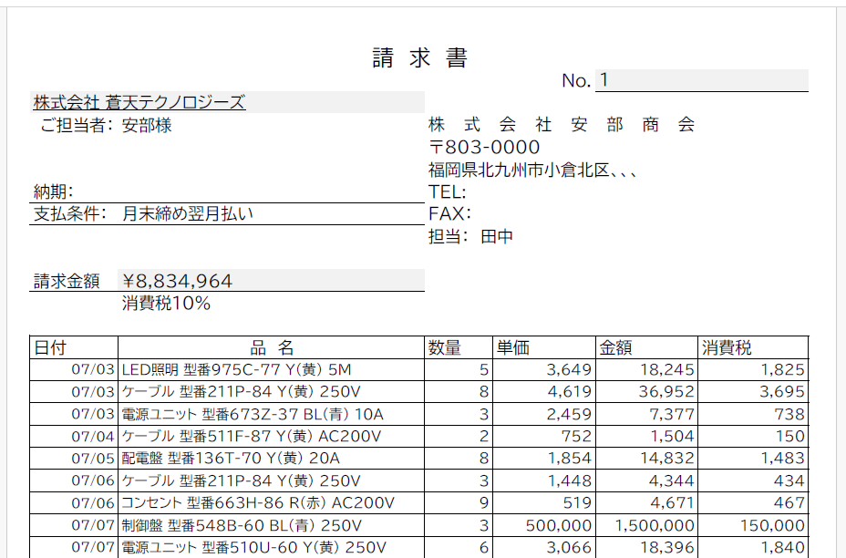

# Access→Excel 請求書ツール

Access から「売上台帳」「請求書対象リスト」を出力し、Excel マクロでフィルタ・整形・請求書/PDF を自動作成するツール。

## 構成
## ライセンス
本プロジェクトは [MIT License](./LICENSE) です。

## 変更履歴
詳細は [CHANGELOG.md](./CHANGELOG.md) を参照してください。

[?? ACCESS�̔��Ǘ��V�X�e�� �~ Excel���[�o�͘A�g�v���W�F�N�g�iNotion�j](https://wide-motion-2bc.notion.site/ACCESS-Excel-24ff5bb7aaa280f59b72d7081825b876?pvs=4)

---

## ?? ��ʃT���v��

---

## ?? ������PDF�T���v��

[?? �������T���v��PDF���_�E�����[�h](docs/invoice_sample_20250814.pdf)

